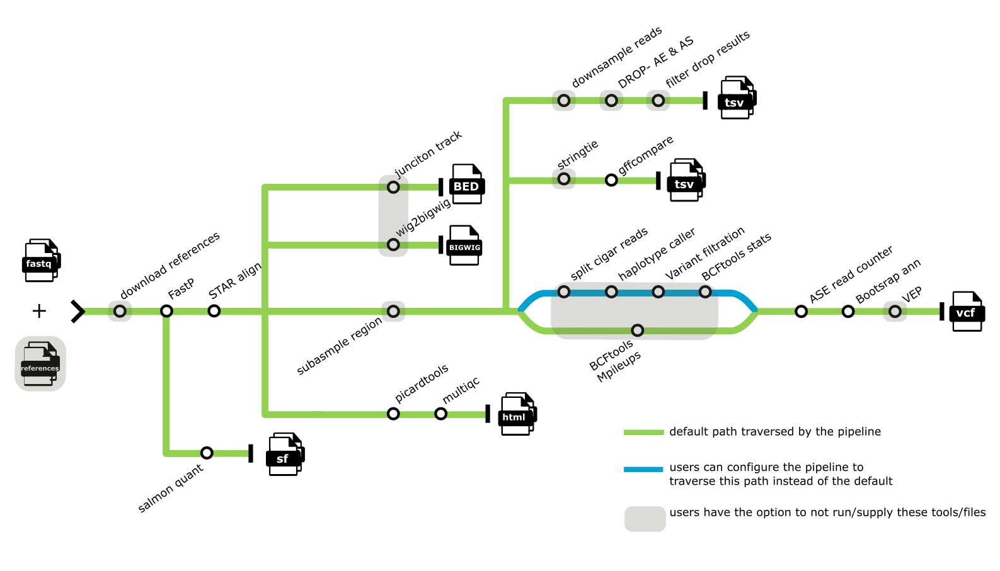

#  

[](https://github.com/genomic-medicine-sweden/tomte/actions?query=workflow%3A%22nf-core+CI%22)
[](https://github.com/genomic-medicine-sweden/tomte/actions?query=workflow%3A%22nf-core+linting%22)[](https://nf-co.re/tomte/results)[](https://doi.org/10.5281/zenodo.XXXXXXX)

[](https://www.nextflow.io/)
[](https://docs.conda.io/en/latest/)
[](https://www.docker.com/)
[](https://sylabs.io/docs/)
[](https://tower.nf/launch?pipeline=https://github.com/genomic-medicine-sweden/tomte)

## Introduction

**genomic-medicine-sweden/tomte** is a bioinformatics best-practice analysis pipeline for Pipeline to analyse RNAseq from raredisease patients.

The pipeline is built using [Nextflow](https://www.nextflow.io), a workflow tool to run tasks across multiple compute infrastructures in a very portable manner. It uses Docker/Singularity containers making installation trivial and results highly reproducible. The [Nextflow DSL2](https://www.nextflow.io/docs/latest/dsl2.html) implementation of this pipeline uses one container per process which makes it much easier to maintain and update software dependencies. Where possible, these processes have been submitted to and installed from [nf-core/modules](https://github.com/nf-core/modules) in order to make them available to all nf-core pipelines, and to everyone within the Nextflow community!

## Pipeline summary

<p align="center">
     
</p>

1. Trim reads ([`FASTP`](https://github.com/OpenGene/fastp))
2. Transcript quantification ([`Salmon`](https://salmon.readthedocs.io/en/latest/))
3. Align reads to the genome ([`STAR`](https://github.com/alexdobin/STAR))
4. Output junction tracks
5. Output bigwig ([`UCSC wigToBigWig`](https://genome.ucsc.edu/goldenPath/help/bigWig.html))
6. Choice to subsample overrepresented regions ([`Samtools`](https://github.com/samtools/samtools/))
7. Choice to downsample number of reads ([`Samtools`](https://github.com/samtools/samtools/))
8. Detection of aberrant expression ([`DROP`](https://github.com/gagneurlab/drop/))
9. Detection of aberrant splicing ([`DROP`](https://github.com/gagneurlab/drop/))
10. Filter aberrant expression and aberrant splicing results
11. Guided transcript assembly ([`StringTie`](https://ccb.jhu.edu/software/stringtie/))
12. Filtering results of guided transcript assembly ([`GffCompare`](https://github.com/gpertea/gffcompare))
13. To Call SNVs either path a or b can be followed. Path A will run by default
    a. Call SNVs
    1. ([`BCFtools Mpileups`](https://samtools.github.io/bcftools/bcftools.html#mpileup))
14. b. Call SNVs
    1. Split cigar reads ([`SplitN Cigar Reads`](https://gatk.broadinstitute.org/hc/en-us/articles/360036858811-SplitNCigarReads))
    2. Haplotype caller ([`Haplotype Caller`](https://gatk.broadinstitute.org/hc/en-us/articles/360037225632-HaplotypeCaller))
    3. Variant filtration ([`Variant Filtration`](https://gatk.broadinstitute.org/hc/en-us/articles/360037434691-VariantFiltration))
    4. BCFtools statistics ([`BCFtools stats`](https://samtools.github.io/bcftools/bcftools.html#stats))
15. Allele Specific Read Counter ([`ASEReadCounter`](https://gatk.broadinstitute.org/hc/en-us/articles/360037428291-ASEReadCounter))
16. Assess allelic imbalance ([`BootstrapAnn`](https://github.com/J35P312/BootstrapAnn#bootstrapann))
17. Annotation ([`VEP`](https://github.com/Ensembl/ensembl-vep))
18. Alignment QC ([`Picard CollectRnaSeqMetrics`](https://broadinstitute.github.io/picard/))
19. Present QCs ([`MultiQC`](http://multiqc.info/))

## Usage

> [!NOTE]
> If you are new to Nextflow and nf-core, please refer to [this page](https://nf-co.re/docs/usage/installation) on how to set-up Nextflow. Make sure to [test your setup](https://nf-co.re/docs/usage/introduction#how-to-run-a-pipeline) with `-profile test` before running the workflow on actual data.

First, prepare a samplesheet with your input data that looks as follows:

`samplesheet.csv`:

```csv
case,sample,fastq_1,fastq_2,strandedness
case_id,sample_id,AEG588A1_S1_L002_R1_001.fastq.gz,AEG588A1_S1_L002_R2_001.fastq.gz,reverse
```

Each row represents a pair of fastq files (paired end).

-->

Now, you can run the pipeline using:

```bash
nextflow run genomic-medicine-sweden/tomte \
   -profile <docker/singularity/.../institute> \
   --input samplesheet.csv \
   --outdir <OUTDIR>
```

:::warning
Please provide pipeline parameters via the CLI or Nextflow `-params-file` option. Custom config files including those
provided by the `-c` Nextflow option can be used to provide any configuration _**except for parameters**_;
see [docs](https://nf-co.re/usage/configuration#custom-configuration-files).
:::

For more details and further functionality, please refer to the [usage documentation](https://github.com/genomic-medicine-sweden/tomte/blob/master/docs/usage.md) and the [parameter documentation](https://github.com/genomic-medicine-sweden/tomte/blob/master/docs/parameters.md).

## Pipeline output

For more details about the output files and reports, please refer to the [output documentation](https://github.com/genomic-medicine-sweden/tomte/blob/master/docs/output.md).

## Credits

genomic-medicine-sweden/tomte was written by Clinical Genomics Stockholm, Sweden, with major contributions from [Lucía Peña-Pérez](https://github.com/Lucpen), [Anders Jemt](https://github.com/jemten), and [Jesper Eisfeldt](https://github.com/J35P312).

Additional contributors were [Ramprasad Neethiraj](https://github.com/ramprasadn), [Esmee ten Berk de Boer](https://github.com/Esmeetbdb), [Vadym Ivanchuk](https://github.com/ivadym), and [Mei Wu](https://github.com/projectoriented).

We thank the nf-core community for their extensive assistance in the development of this pipeline.

## Contributions and Support

If you would like to contribute to this pipeline, please see the [contributing guidelines](.github/CONTRIBUTING.md).

For further information or help, don't hesitate to get in touch by opening an [issue](https://github.com/genomic-medicine-sweden/tomte/issues).

## Citations

If you use genomic-medicine-sweden/tomte for your analysis, please cite it using the following doi: [XX.XXXX/zenodo.XXXXXXX](https://doi.org/XX.XXXX/zenodo.XXXXXXX)

An extensive list of references for the tools used by the pipeline can be found in the [`CITATIONS.md`](CITATIONS.md) file.

This pipeline uses code and infrastructure developed and maintained by the [nf-core](https://nf-co.re) community, reused here under the [MIT license](https://github.com/nf-core/tools/blob/master/LICENSE).

> **The nf-core framework for community-curated bioinformatics pipelines.**
>
> Philip Ewels, Alexander Peltzer, Sven Fillinger, Harshil Patel, Johannes Alneberg, Andreas Wilm, Maxime Ulysse Garcia, Paolo Di Tommaso & Sven Nahnsen.
>
> _Nat Biotechnol._ 2020 Feb 13. doi: [10.1038/s41587-020-0439-x](https://dx.doi.org/10.1038/s41587-020-0439-x).
